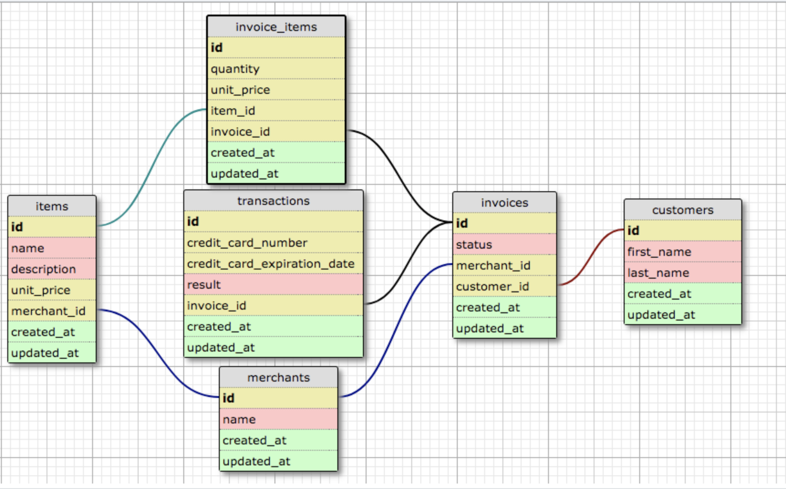

# Rales Engine

The Rales Engine app manages data to execute business intelligence queries. The user can review sales engine data for merchants, items, invoices, invoice items, transactions, and customers. This application uses Ruby on Rails 5.2, ActiveRecord, and the tests are done with FactoryBot and RSpec.

In order to "seed" the data, we created a rake task that parses through the CSVs from the spec harness in the lib/task folder. You import the CVSs by running rake import:all. Below is a
diagram of the tables and their relationships.



# Set up and Installation

1. clone down the repo.  
`git clone github.com/shebesabrina/rails-engine.git`   
`bundle update`

2. Set up the migration.  
`rake db:{create,migrate}`

3. Import the CSV data.  
`rake import:all`

4. Check that the data has been imported.  
 * `rails c`
 ```
 Customer.first
 Merchant.first
 Item.first
 Invoice.first
 InvoiceItem.first
 Transaction.first
 ```

## Running the tests
To run the test suite, simply run rspec terminal command from the root directory.  
`rspec`

## Deployment
To deploy Rails Engine locally, start the server in your terminal.  
`rails s`

## Endpoints

### Merchants
* GET `/api/v1/merchants/:id/items` returns a collection of items associated with that merchant
* GET `/api/v1/merchants/:id/invoices` returns a collection of invoices associated with that merchant from their known orders

### Invoices
* GET `/api/v1/invoices/:id/transactions` returns a collection of associated transactions
* GET `/api/v1/invoices/:id/invoice_items` returns a collection of associated invoice items
* GET `/api/v1/invoices/:id/items` returns a collection of associated items
* GET `/api/v1/invoices/:id/customer` returns the associated customer
* GET `/api/v1/invoices/:id/merchant` returns the associated merchant

### Invoice Items
* GET `/api/v1/invoice_items/:id/invoice` returns the associated invoice
* GET `/api/v1/invoice_items/:id/item` returns the associated item

### Items
* GET `/api/v1/items/:id/invoice_items` returns a collection of associated invoice items
* GET `/api/v1/items/:id/merchant` returns the associated merchant

### Transactions
* GET `/api/v1/transactions/:id/invoice` returns the associated invoice

### Customers
* GET `/api/v1/customers/:id/invoices` returns a collection of associated invoices
* GET `/api/v1/customers/:id/transactions` returns a collection of associated transactions
